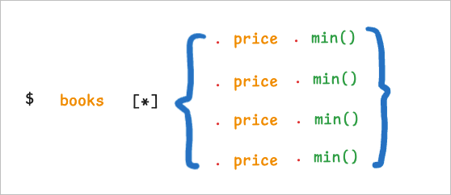

# ObjectPath

[](https://sonarcloud.io/summary/new_code?id=catman-cc_objectpath)
[](https://github.com/catman-cc/objectpath/actions/workflows/compile-and-unit-test.yml)

[中文文档](./README-zh.md) | [English Document](../README.md)
# README

>> ObjectPath是一个用于访问java对象的路径解析器,类似于jsonpath,但是ObjectPath用于访问和修改java对象,而不是json对象.
>>

首先聊一聊为什么会有objectpath这个库,目前支持jsonpath的语法的主流库有两个:

* [jayway的json-path](https://github.com/json-path/JsonPath)库,该库用于从json文档中读取内容,但是该库仅支持操作json字符串, 或者其定义的json文档对象.

* [alibaba的fastjson](https://github.com/alibaba/fastjson2)库,该库可以操作json内容,也可以操作java对象,且具有非常好的性能, 但是其语法支持不够完善,缺少很多jsonpath的高级特性.

二者都有非常明显的优势和劣势,其中json-path支持的语法更为灵活且丰富,但只能操作json字符串或者特定的Json Document对象.

fastjson在性能上具有非常明显的优势,而且可以直接操作java对象,但劣势是其只支持基础的jsonpath语法,且不够灵活.

我需要的是一个能够直接操作原生java对象,且保持灵活丰富的jsonpath语法的一个类库,在经过一番搜索后,没有找到合适的库,于是就开发了这个库.

在使用该库之前,依然建议先判断该库是否真的有你必须使用的理由,否则json-path或者fastjson可能是你更好的选择.

> 如果您需要一个可以使用jsonpath语法访问java对象的库,且要求具有jsonpath的高级特性,以及可以灵活扩展的功能,那么ObjectPath就是为您准备的.
>
> 因为,ObjectPath的目标就是提供一个易于使用的,灵活的,功能丰富的,易于扩展的,可靠的java对象访问库.

> objectpath的语法是jsonpath的超集,所以jsonpath的语法规则在objectpath中同样适用,同时objectpath还支持一些额外的语法规则.

## 快速上手

objectpath已经打包上传到maven中央仓库,因此可以直接通过下面的代码引入:

```java
<dependency>
    <groupId>cc.catman</groupId>
    <artifactId>objectpath</artifactId>
    <version>0.0.1</version>
</dependency>
```

objectpath提供了一个开箱即用,无需任何配置的`OP`​对象,可以直接调用其parse方法来解析jsonpath语法,继续调用eval方法即可获取jsonpath语法解析后的数据,

```java
OP.parse("$.book[0].price").eval(new Order());
```

当然,我们还提供了另外一个`ObjectPath`​对象,该对象提供了两个静态重载的`of`​方法:

* ​`public static ObjectPathAccessor of(String path, ObjectPathConfiguration config) `​
* ​` public static ObjectPathAccessor of(String path)`​

其中` public static ObjectPathAccessor of(String path)`​的效果和OP的parse方法一致,另一个方法则允许用户额外提供一个配置对象,该对象用于定制化jsonpath的解析过程.

> 关于配置对象的具体细节请参考[ObjectPath的配置对象部分](https://assets.b3logfile.com/siyuan/1628429413759/#ObjectPath的配置对象)

‍

为了更好的展示objectpath的语法规则,下面的示例中使用的java对象信息如下:

```java
{
  "store": {
    "id": "storeID",
    "book": [
      {
        "id": "book1",
        "category": "reference",
        "author": "Nigel Rees",
        "title": "Sayings of the Century",
        "price": 8.95,
        "costPrice": 5.1
      },
      {
        "id": "book2",
        "category": "fiction",
        "author": "Evelyn Waugh",
        "title": "Sword of Honour",
        "price": 12.99,
        "costPrice": 5.99
      },
      {
        "id": "book3",
        "category": "fiction",
        "author": "Herman Melville",
        "title": "Moby Dick",
        "isbn": "0-553-21311-3",
        "price": 8.99,
        "costPrice": 4.99
      },
      {
        "id": "book4",
        "category": "fiction",
        "author": "J. R. R. Tolkien",
        "title": "The Lord of the Rings",
        "isbn": "0-395-19395-8",
        "price": 22.99,
        "costPrice": 12
      }
    ],
    "bicycle": {
      "id": "bicycle1",
      "color": "red",
      "price": 19.95,
      "costPrice": 12.05
    }
  },
  "expensive": 10
}
```

ObjectPath的语法是十分灵活且强大的,在绝大多数的位置上,我们都可以直接使用内联的jsonpath语法.

比如,针对标准的jsonpath语法:`$["book"][0]`​,我们可以使用下面的这些拥有同等效果的语法来替代:

* ​`$['b'+'ook'][1-1]`​
* ​`$['b'.concat('o')+'ok'][1-1]`​

```java
    @Test
    public void useExprFillAnyPart() {
        StoreHolder sh= Cases.storeHolder();
        Store store = sh.getStore();
        Book want = store.getBook().get(0);
        Stream.of(
                "$[book][0]"
                ,"$['b'+'ook'][1-1]"
                ,"$['b'.concat('o')+'ok'][1-1]"
        ).forEach(expr->{
            Book find = OP.parse(expr).eval(store, Book.class);
            Assert.assertEquals(want,find);
        });
    }
```

‍

## 语法规则

### 基础语法规则

一个合法的jsonpath表达式由两部分构成,定位符.选择器.

其中定位符有两个,他们分别是:

* @: 表示当前元素,比如: @.id,表示访问当前元素的id值,其会根据解析的上下文而发生变化

  假设我们有下面两个jsonpath文本用于访问前面给出的示例对象: `@.id`​,`@.book[?(@.id like '%a%')]`​,二者都包含`@.id`​,但前者对应的值是`storeID`​,后者对应的是book集合中每一个元素的id,比如: `book1`​,`book2`​.
* $: 表示根元素,其固定访问根对象,假设还是前面两个场景,我们将`@.id`​替换成`$.id`​,其取值将固定是`storeID`​.

而选择器则相对更灵活一些,为了方便理解,我将选择分为以下几种:

最直接的也是最常用的当然就是子元素选择器了,其负责完成内部资源的最基础的访问操作,

|表达式|描述|示例|示例描述|返回值|
| -------------| -------------------------------------------------| -----------| ----------------------------------------------------------------| ---------------------|
|​`.number`​\|`.name`​|获取指定索引/名称的子元素|$.book|获取根元素的名为book的子元素|[],省略|
|​`..ID`​|递归下降,获取所有指定名称的子元素|$..id|获取所有名为id的元素|​`["70...215","39..46e",...]`​|
|​`[ID(,ID)+]`​|获取当前元素的多个子元素,并合并成map对象|​`$.book[0]['id','price']`​|获取book数组中第一个元素的id和price数据,并组合出map|​`{"id""3993c542-66ba-459d-bcea-97434f8aa46e":,"price":300}`​|
|​`[ID]`​|获取指定名称的子元素|​`$[book`​]<br />`$.book[0]`​|获取指定名称的资源|[]省略,<br />{"id":...}|
|​`[表达式]`​|支持通过表达式返回文本或者数值,并访问对应的元素|​`$[book][1-1]`​|支持通过表达式来计算各部分的数据|等同于`$[items][0]`​|
|​`[*]`​|访问集合中的所有元素|​`$[book][*]`​|注意和`$[book]`​区分,`$[book]`​表示访问book对象,而`$[book][*]`​表示访问其中的每一个子元素||
|​`[start:end?]`​|截取集合,获取新的集合|​`$[book][0,1]`​|截取book集合中从0至1的数据,组成新的集合||
|​`[num(,num)+]`​|挑选集合中指定位置的元素,组成新的集合|​`$[book][0,1,3]`​|挑选book集合中下标为0,1,3的元素组成新的集合||

除了子元素访问器之外,jsonpath语法中的另一个高频率的语法就是**过滤器语法**了,他是一种特殊的子元素访问器,其通常作用于集合元素,**用于获取集合中的部分符合特定条件的元素**.

过滤器语法很简单: `[?(返回boolean值的判断)]`​,比如我们前面示例中的`@.book[?(@.id like '%a%')]`​,用于过滤book集合中id包含文本a的记录.

为了让过滤器语法生效,我们为其提供了很多内置的表达式或者方法用来做一些判断,同时在进行数据比较时,我们还会用到一些字面量比如数值或者文本,所以我们内置了一些字面量的支持,同时还提供了常见的逻辑运算以及算数计算支持:

|表达式|描述|示例|示例描述|
| ---------------------------| ------------------------------------------------------------| ------------------------------------| ----------------------------------------------------------------------------------------|
|​`'文本内容'`​\|`"文本内容"`​|文本类型|​`'hello,world'`​|提供一个hello,world字符串|
|​`-1`​\|`0.2`​\|`0.2D`​|数值|​`-1`​\|`0.2`​\|`0.2D`​|提供数值类型,可以通过在数值后面加上`L`​\|`l`​\|`D`​\|`d`​来强制指定数值类型为`Long`​或者`Double`​|
|​`true`​\|`TRUE`​\|`false`​\|`FALSE`​|boolean|​`true`​|提供boolean类型的值,用于表示真或假|
|​`/正则/`​|特殊的文本: 正则表达式|​`/^j.*?a$/`​|提供正则表达式`^j.*?a$`​|
|合法的json内容|合法的json结构也可以作为表达式,其将会被序列化集合或map|​`{"name":"jpanda","age":18}`​|提供一个json对象,该对象被序列化为map|
|​`expr?:expr`​ \|`expr?expr:expr`​|默认值表达式|​`@.price?:10`​\|`@.price?@.costPrice<@price:10`​|如果当前的price是null,则使用数值10.<br />如果当前costPrice小于price,则使用10.<br />|
|​`( expr )`​<br />|分组提升优先级|(@.price-@.costPrice)*@.quantity<br />|目前算数运算不支持`*/%`​的默认高优先级,可以借助于分组来定制优先级.|
|​` expr ('+'\|'-'\|'*'\|'/'\|'%') expr`​|算数运算|​`@.price-@.costPrice`​|支持基础的加减乘除取模运算|
|​`expr == expr`​|逻辑判断,等于|​`@.price==@.costPrice+10`​|当前元素的price是否等于costPrice+10|
|​`expr != expr`​|逻辑判断,不等于|​`@.price!=@.costPrice+10`​|当前元素的price是否不等于costPrice+10|
|​`expr < expr`​|逻辑判断,小于|​`@.price<@.costPrice+10`​|当前元素的price是否小于costPrice+10|
|​`expr <= expr`​|逻辑判断,小于等于|​`@.price<=@.costPrice+10`​|当前元素的price是否小于等于costPrice+10|
|​`expr > expr`​|逻辑判断,大于|​`@.price>@.costPrice+10`​|当前元素的price是否大于costPrice+10|
|​`expr >= expr`​|逻辑判断,大于等于|​`@.price>=@.costPrice+10`​|当前元素的price是否大于等于costPrice+10|
|​`expr is null`​|逻辑判断,是否为空|​`@.name is null`​|当前元素的name是null|
|​`REG '~=' expr `​|逻辑判断,左侧参数必须是正则表达式,该表达式用于验证右侧的值|​`/^j.*$/ ~=@.name`​|当前元素的`name`​是否符合正则`^j.*`​|
|​`expr '=~'REG`​|逻辑判断,右侧参数必须是正则表达式,该表达式用于验证左侧的值|​`@.name =~ /^j.*$/`​|当前元素的`name`​是否符合正则`^j.*`​|
|​`expr 'like'  expr`​|逻辑判断,模式匹配,参考方法like|@.name like '%panda%'|判断当前元素的name是否包含`panda`​|
|​`expr ('and'\|'&&') expr`​|逻辑且|​`@.price>100 && @.costPrice<50 &&@.price-@costPrice>100`​|过滤成本价小于50,售价大于100,且利润高于100的数据.|
|​`expr ('or'\|'\|\|') expr`​|逻辑或|​`@.price>100 \|\| @.costPrice<50 \|\| @.price-@costPrice>100`​|过滤成本价小于50,或者售价大于100,或者利润高于100的数据.|
|​`!expr`​|非|​`!@.price>100`​|price不大于100|

除此之外,还提供了大量的内置方法来面对更复杂的场景:

|方法名|描述|调用方类型|返回值类型|参数数量|参数类型|
| -------------| ----------------------------------------------------------------------------------------------------------------------------------------------| -----------------------------| ---------------------| ----------| ---------------------------------------------------|
|​`min`​|获取指定集合中值**最小**的元素,用户可以提供一个参数来过滤集合元素,通过@符号可以访问到集合中的每一个元素|集合|集合元素|1|返回数值的表达式|
|​`max`​|获取指定集合中值**最大**的元素,用户可以提供一个参数来过滤集合元素,通过@符号可以访问到集合中的每一个元素|集合|集合元素|1|返回数值的表达式|
|​`sum`​|计算集合中数值的总数,方法接受一个参数用于提供获取待计算值.|数值集合|数值|1|返回数值的表达式<br />|
|​`avg`​|计算集合中数值的平均数,方法接受一个参数用于提供获取待计算值.|数值集合|数值|1|返回数值的表达式<br />|
|​`size`​\|`count`​|获取集合中元素的数量|集合|数值|0|数值|
|​`isEmpty`​<br />|判断集合是否为空集合|集合|boolean|0|-|
|​`index`​|获取集合中元素的索引,如果当前元素所属的map或者对象,则获取对应的key值.|(集合\|对象\|MAP)元素|数值/文本|0|-|
|​`length`​|获取文本长度,或者集合长度|集合\|文本|数值|0|-|
|​`keys`​|获取当前对象下的所有元素的标志|集合\|对象\|MAP|(数值\|文本)集合|0|集合<br />|
|​`values`​|获取当前对象下的所有值|集合\|对象\|MAP|对象集合|0|集合<br />|
|​`reverse`​|反转当前集合|集合|集合|0|集合<br />|
|​`distinct`​\|`dis`​|对当前集合进行去重|集合|集合|<2|任意|
|​`sort`​|对集合做排序,可以提供一个或多个用于计算排序的表达式,表达式将依次影响排序结果|集合|集合|>1|boolean|
|​`rsort`​|对集合做倒排,可以提供一个或多个用于计算排序的表达式,表达式将依次影响排序结果|集合|集合|>1|boolean|
|​`groupBy`​|对向前集合进行分组,可以提供一个用于做分组依据的表达式,表达式将依次影响排序结果|集合|集合|1|任意|
|​`join`​|将一个或多个集合加入到当前集合|集合|集合|>1|任意|
|​`split`​|对文本进行分割,必须提供一个返回字符串的表达式,所返回的字符串用于分割文本|文本|文本集合|1|文本|
|​`replace`​|替换文本内容,必须提供两个表达式,第一个表达式表示待替换的内容,第二个表达式表示替换后的内容|文本|文本|2|文本|
|​`substring`​\|`sub`​|截取文本内容,接收1个或者两个参数,第一个参数用于提供截取文本的起始位置(包含),第二个可选的参数表示截取文本的结束为止(不含),默认值为文本的长度.|文本|文本|>1且<2|数值|
|​`toUpper`​|将文本大写|文本|文本|0|-|
|​`toLower`​|将文本小写|文本|文本|0|-|
|​`trim`​|截取文本的前后空白符|文本|文本|0|-|
|​`ltrim`​|截取文本左侧的空白符|文本|文本|0|-|
|​`rtrim`​|截取文本右侧的空白符|文本|文本|0|-|
|​`concat`​|连接两个字符串,需要提供一个返回文本的表达式,可以使用+运算符取代|文本|文本|1|文本|
|​`first`​|获取集合中的第一个元素|集合|集合元素|0|-|
|​`last`​|获取集合中的最后一个元素|集合|集合元素|0|-|
|​`indexOf`​|获取集合中指定位置的元素/对象中指定名称的元素|集合|集合元素|1|数值\|文本|
|​`map`​|通过一个表达式将当前对象转换为另一个对象|任意|任意|1|任意|
|​`toMap`​|将当前元素转换为map集合|集合\|对象\|MAP|MAP|0|-|
|​`isNull`​|判断当前元素是否为null,如果提供了参数,则参数值作为判断标准|任意|boolean|<2|任意|
|​`notNull`​|判断当前元素是否不是null,如果提供了参数,则参数值作为判断标准|任意|boolean|<2|任意|
|​`and`​|逻辑且,可以提供多个用`,`​分割的表达式,每个表达式必须返回可以转换为boolean类型的值.|任意|boolean|>1|boolean|
|​`or`​|逻辑或,可以提供多个用`,`​分割的表达式,每个表达式必须返回可以转换为boolean类型的值.|任意|boolean|>1|boolean|
|​`not`​|反转当前逻辑,可以接受一个表达式,该表达式必须返回可以转换为boolean类型的值,如果提供了参数,则参数值作为判断标准|任意|boolean|<2|boolean|
|​`filter`​|过滤,可以使用标准`[?(filter)]`​取代,接收一个或多个用于筛选元素的条件,多个条件之间保持逻辑且的关系.|集合|集合|>0|boolean|
|​`between`​|判断当前元素是否在指定数值的范围内,接收两个参数分别用于表示最小值和最大值,匹配时包含最小值和最大值.|数值|boolean|2|数值|
|​`like`​|参考sql语法,支持通过前后的`%`​来做模式匹配,可以分别使用`startWith`​,`endWith`​,`==`​来取代.|字符串|boolean|1|文本|
|​`in`​|判断当前袁术是否存在于枚举出的数据中|任意|boolean|>1|任意|
|​`notIn`​|​`in`​的反操作|任意|boolean|>1|任意|
|​`contains`​|判断当前集合是否包含枚举出的数据|集合|boolean|>|任意|
|​`startWith`​|判断是否以指定内容开始|文本|boolean|1|文本|
|​`endWith`​|判断是否以指定内容结束|文本|boolean|1|文本|
|​`match`​|判断是否匹配指定正则|文本|boolean|1|文本|
|​`raw`​|调用java原生方法,需要至少一个参数,第一个参数需要返回java原生名称名称,后续参数的值则作为调用方法的参数.|任意|任意|>0|第一个参数要求必须是文本,后续参数可以返回任意类型|
|自定义函数|调用自定义函数|自定义|任意|>-1|任意|

## 高级语法规则

除了前面提到的基础语法规则,objectpath还提供了更丰富的特性,以便于开发者快速实现一个新的功能,

##### 强制类型转换

在jsonpath语法中,因为计算或者函数操作等原因,可能导致解析过程中的数据类型不符合我们的预期,比如期望得到一个int类型的数值,实际却是double类型的数值,为了解决该问题,我们提供了强制类型转换的语法支持,其语法参考java,通过`(类型)表达式`​或者`(类型)(表达式)`​的方式即可完成类型转换,同时在类型后面添加`[]`​,表示对应类型的集合.

目前支持的内置类型有:

|java类型|类型文本|示例|
| ----------| --------------------| --------------|
|​`String`​|​`String`​\|`string`​\|`str`​|(str)@.name|
|​`Integer`​|​`Integer`​\|`I`​|(I)@.price|
|​`int`​|​`int`​\|`i`​|(i)@.price|
|​`Double`​|​`Double`​\|`D`​|(D)(@.price)|
|​`double`​|​`double`​\|d|(d)@.price|
|​`Boolean`​|​`Boolean`​\|`B`​<br />|(B)@.isAdmin|
|​`boolean`​|​`boolean`​\|`b`​|(b)@.isAdmin|
|​`Float`​|​`Float`​\|`F`​|(F)@.price|
|​`float`​|​`float`​\|`f`​|(f)@.price|
|​`Long`​|​`Long`​\|`L`​|(L)@.price|
|​`long`​|​`long`​\|`l`​|(l)@.price|
|​`Short`​|​`Short`​\|`S`​|(S)@.price|
|​`short`​|​`short`​\|`s`​|(s)@.price|
|​`Byte`​|​`Byte`​|(B)@.price|
|​`byte`​|​`byte`​|(b)@.price|
|​`Character`​|​`Character`​\|`C`​|(C)@.price|
|​`char`​|​`char`​\|`c`​|(c)@.price|

##### 管道操作

参考unix*中的管道符, 我们同样使用*​ *​`|`​* ​*来作为管道符,通过管道符我们将一个objectpath表达式拆分为多个阶段,数据流经管道时,将会重新被聚合为一个对象,其主要目的是为了解决语法*​ *​`[*]`​* ​会隐式的将上下位拆分为多个子上下文执行的问题.

> 📢.通常情况下在进行语法解析时,右侧表达式所属的主体对象属于左侧表达式的对应值,但是`[*]语法`​会隐式的拆分当前主体对象,由一个集合,拆分为其内部相应的元素.

比如:`$.book[*].price`​的目的是获取book集合中所有book元素的price值,并在解析完成构建成一个新的集合,作为返回值.

请注意,这里的`.price`​在解析时所属的主体是集合中的每一个book元素,而不是整个book数组,在此基础上,如果我们继续向后扩展语法得到:`$.book[*].price.min()`​.

那么`min`​函数所属的主体是每一个price,还是price数组呢?

从逻辑上来看,我的目的是为了获取price数组中的最小值,所以`min`​对应的主体应该是price数组,但请思考一个问题:

> 我们应该通过什么样的语法才能够对每一个price都进行一些额外的操作呢?

比如,我现在自定义了一个roundUp函数,该函数用于对数值进行上取整操作,并且接受一个数值类型的参数来控制原始值保留的小数位.

* ​`$.book[*].price.roundUp(2)`​ 调用roundUp函数,对price做取整操作,并保留两个小数,此处,roundUp函数对应的主体是否应该是每一个price元素呢?

很明显这里产生了二义性,为了规避该问题,我们在解析时,当遇到`[*]`​时,会从此处阶段表达式,将后续的表达式应用在集合中的每一个元素上,

因此,语法`$.book[*].price.min()`​在解析时,从`.price`​开始,其所属的主体不再是`$.books`​对应的值,而是`$.books`​所对应集合中的每一个元素的值:



在这种设计的基础上,我们如何让后续的某一些表达式再次应用到整个集合上呢?为此我们提供了管道符,

通过管道符,我们就可以先获取到所有book元素的price字段,再获取其中的最小值了,对应的语法为: `$.book[*].price|@.min()`​,当然事实上我们可以通过语法`$.books.min().price`​实现同样的效果,

##### 自定义函数

objectpath支持用户提供自定义函数来实现一些复杂的逻辑,且在体验上保持着和内置函数一样的效果.

我们可以通过下面的代码创建一个用于格式化日期的函数.

在实现自定义函数时,我们需要创建一个`FunctionProvider`​的实现类,系统内置了`AbstractFunctionProvider`​来简化实现的成本,然后可以通过ObjectPathConfiguration的FunctionManager注册自定义函数,完整的代码如下:

* 创建一个自定义函数提供者

  ```java
  package cc.catman.object.core.function;

  import cc.catman.object.core.ObjectPathParserContext;
  import cc.catman.object.core.exception.FunctionRuntimeException;
  import lombok.extern.slf4j.Slf4j;

  import java.text.SimpleDateFormat;
  import java.util.Collections;
  import java.util.Date;
  import java.util.List;
  /**
   * 日期格式化函数提供者,用于格式化日期
   * 支持的参数有: Date,Timestamp,Long,String
   * @author jpanda
   * @since 0.0.1
   */
  @Slf4j
  public class DateFormatFunctionProvider extends AbstractFunctionProvider{

      public DateFormatFunctionProvider(String name) {
          super(name);
          FunctionArgDesc format = FunctionArgDesc.builder()
                  .type(String.class)
                  .desc("格式")
                  .build();
          this.args().add(Collections.singletonList(
                  format

          ));
      }

      @Override
      protected Object doApply(ObjectPathParserContext context,List<Object> params) {
          if (params.size() != 1) {
              log.error("参数数量不匹配");
              return null;
          }
          Object date = context.currentValue().read();
          Object format = params.get(0);
          if (date instanceof java.util.Date) {
              return new SimpleDateFormat(format.toString()).format((Date) date);
          } else if (date instanceof Long) {
              return new SimpleDateFormat(format.toString()).format(new Date((Long) date));
          } else if (date instanceof String) {
              long time;
              try {
                  time = Long.parseLong((String) date);
              } catch (NumberFormatException e) {
                  throw new FunctionRuntimeException(e, this.name(), params);
              }
              return new SimpleDateFormat(format.toString()).format(new Date(time));
          }
          return null;
      }

  }

  ```

  📢注意看上述DateFormatFunctionProvider的构造函数部分中`this.args().add`​相关的代码,我们允许自定义函数提供对个不同的参数列表以适配不同的参数类型,该字段是一个二维数组,内部的每一组参数类型描述都提供了一组其可以支持的参数类型列表.

  ```java

      /**
       * 函数参数描述
       */
      private final List<List<FunctionArgDesc>> args;
  ```

  另外,在自定义函数被调用时,将会隐式的获取到调用该函数的上下文,我们可以通过context.currentValue().read()方法来获取调用函数的触发对象.
* 注册函数到自定义函数管理器

  ```java
          ObjectPathConfiguration configuration = ObjectPathConfiguration.create();

          FunctionManager fm = configuration.getFunctionManager();
          fm.register(new DateFormatFunctionProvider("format"));
           // 使用自定义函数
          ObjectPath op = ObjectPath.builder()
                  .config(configuration)
                  .build();
          long now = System.currentTimeMillis();
          Map<String,Long> map=new HashMap<>();
          map.put("time",now);
          ObjectPathAccessor ac = op.parse("$.time.format('yyyy-MM-dd HH:mm:ss')");
          Object res = ac.eval(map);
          Assert.assertEquals(new SimpleDateFormat("yyyy-MM-dd HH:mm:ss").format(now),res);
  ```

##### 调用java对象的内置方法

objectpath支持直接调用java对象的方法,在调用前我们需要先开启相关的权限,基于安全考虑,该权限默认是关闭的:

```java
 ObjectPathConfiguration cfg = ObjectPathConfiguration.create();
 cfg.setAllowExecuteRawMethod(true);
```

在开启该开关后,我们可以通过`.raw(方法名称,参数列表)`​的形式来完成内置函数的调用,比如,下面的函数调用`java`​内置集合的`size`​方法:

```java
@Test
public void  funcForRaw(){
    Order order = OrderMock.mockOrderWithFixedSize(10);
    String expr="$.items.raw('size')";
    ObjectPathConfiguration cfg = ObjectPathConfiguration.create();
    cfg.setAllowExecuteRawMethod(true);
    ObjectPathAccessor as = ObjectPath.parse(expr,cfg);
    Integer res = as.eval(order,Integer.class);
    Assert.assertEquals(10, (int) res);
}
```

当然我们也可以调用自定义对象的方法,如果方法有重载的场景,也会尽可能去选择合适的方法去执行,其逻辑是这样的:

首先会验证方法名称和参数数量,然后再去对比参数类型,考虑到实际参数列表可能包含null值,以及子类定义,所以会遍历所有符合基础要求的方法,然后再尝试查找到匹配的方法.

匹配的方法分为两种:

* 最佳方法: 先获取所有方法,然后遍历方法列表,对比参数列表,如果参数类型完全一致,则返回该方法,该方法被视为最佳方法.
* 候选方法: 接收处理null值和子类,需要注意的是,如果存在多个方法参数列表一致,则无法确定调用哪个方法,所以会抛出异常

比如,我们现在有下面两个class定义:

```java
public static class A{
    public String hello(){
        return "hello";
    }
    public String hello(String name){
        return "hello," + name;
    }
    public String hello(String name, Number age){
        return "hello," + name + " age: " + age;
    }
}

public static class B extends A{

    public String hello(String name,Object obj){
        return "hello," + name + " age: " + obj;
    }
}
```

预期的调用结果是这样的:

```java

@Test
public void findSubstringMethod(){
    Object res = ReflectionHelper.invokeMethod("hello world", "substring", Arrays.asList(0, 5));
    assertEquals("hello", res);
}

@Test
public void invokeSameNameMethod(){
    A a = new A();
    Assert.assertEquals("hello", ReflectionHelper.invokeMethod(a,"hello", Collections.emptyList()));
    Assert.assertEquals("hello,world", ReflectionHelper.invokeMethod(a, "hello", Collections.singletonList("world")));
    Assert.assertEquals("hello,world age: 18", ReflectionHelper.invokeMethod(a, "hello", Arrays.asList("world", 18)));

    boolean hasException=false;
    try {
        Assert.assertEquals("hello,world age: 18", ReflectionHelper.invokeMethod(a, "hello", Arrays.asList("world", new Date())));
    } catch (PropertyAccessorRuntimeException e) {
        hasException=true;
    }
    Assert.assertTrue(hasException);
    hasException=false;
    B b = new B();
    try {
        Assert.assertEquals("hello,world age: 18", ReflectionHelper.invokeMethod(b, "hello", Arrays.asList("world", 18)));
    } catch (PropertyAccessorRuntimeException e) {
        hasException=true;
    }
    Assert.assertTrue(hasException);
}
```

##### 调用脚本引擎

除了上述所说的特性之外,objectpath语法还添加了对脚本语言的支持.系统内置了`JavaScriptExecutor`​用于提供对js脚本语言的支持,但默认情况下,其未被启用,需要用户手动将其注册到脚本语言管理器中.

下面是一个简单的示例:

```java
        ObjectPathConfiguration configuration = ObjectPathConfiguration.create();

        configuration.getScriptExecutorManager().addExecutor("js",new JavaScriptExecutor());

        ObjectPath op = ObjectPath.builder()
                .config(configuration)
                .build();
        Map<String,String> map=new HashMap<>();
        map.put("name","world");
        ObjectPathAccessor ac = op.parse("$.name.[<js name=$.name>return \"hello,\"+name;</js>]");
        Object res = ac.eval(map);
        Assert.assertEquals("hello,world", res);
```

请注意上述代码中的`addExecutor`​方法调用,该方法接收两个参数,第一个值为脚本语言的名称,第二个则是脚本语言执行器实例,其中脚本语言名称要和第10行中的脚本语言名称保持一致.

‍
